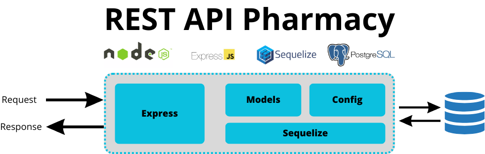
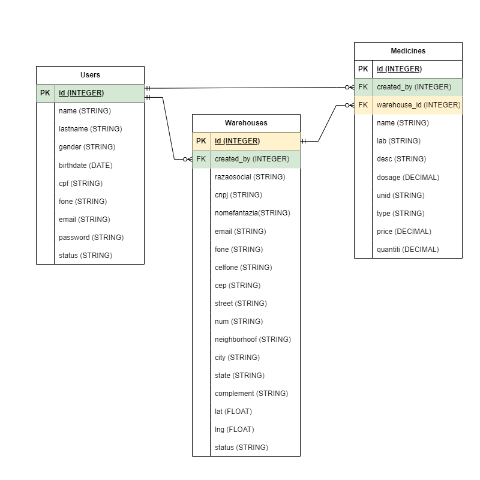

# API-LabPharmacy

### Projeto de API (Back-End) para LabPharmacy Inc.

#### Descrição

Desenvolvimento de um back-end para LabPharmacy Inc. o sistema será codificado em Node, utilizando o framework Express e Sequelize com o uso do banco de dados PostgreSQL.
Tem o objetivo de permitir que o front-end acesse via http o banco de dados para adicionar, editar, consultar e apagar conteúdos das tabelas usuários, depósitos e medicamentos. O framework Expresse foi utilizado para gestão dos paths http da aplicação e o ORM Sequelize tem o objetivo de gerenciar os acessos e construção do DataBase.

##### Melhorias Futuras

Serão implementadas os controles de acesso do usuário através do uso de JWT e RBAC para que as ações no app sejam limitadas ou liberadas por grupos de usuários.



##### Planejamento deste projeto está acessível no link do Trello abaixo

#

```bash
https://trello.com/invite/b/MZivoNge/ATTIc3c795674aae6822aac50bdd08e9ba3d0F5F96C3/devfullstack-avm2
```

##### Para utilizar este projeto como base, faça o seguinte passo-a-passo:

- Clone o projeto para a sua máquina

```bash
https://github.com/EricoCoutoJr/DevFullStack---AVM2.git
```

- Instale as dependências (lembre-se de acessar a pasta correta no terminal)

```bash
npm install
```

- Rode o projeto

```bash
npm run dev
```

#### Observações

##### Serão usadas a seguinte dependências:

- express
- sequelize
- cors
- jwt

##### Também é necessária a instalação da dependência de desenvolvimento

```bash
npm install nodemon --save-dev
```

##### .env_exemplo deve ser renomemado para .env e deve ser editado com os dados do seu DB

- DB_NAME=<NOME DO BANCO DE DADOS>
- DB_USER=<USUÁRIO>
- DB_PASSWORD=<PASSWORD>
- DB_HOST=<ENDEREÇO DO SERVIDOR>
- DB_DIALECT=<BANCO DE DADOS>
- DB_PORT=<PORTA>

- JWT_SECRET_KEY=<USE UMA HASH A SUA ESCOLHA>

##### Relação entre as tabelas do Data-Base

- Um usuário pode ter muitos medicamentos (User -> UserMedicines -> Medicine).
- Um usuário pode ter muitos medicamentos (User -> UserMedicines -> Medicine).
- Cada medicamento, em cada depósito, só pode ter um usuário associado (Medicine -> Warehouse).
- Medicamentos podem se repetir em warehouses diferentes.
- Um usuário pode ter N depósitos (User -> UserWarehouses -> Warehouse).
- Um usuário pode ter N medicamentos registrados em qualquer um dos depósitos, mesmo que não tenha criado os depósitos.
##### Diagrama da estrutura do database 


##### Descrição dos end-points


| End-Point (usuários)                                   | Descrição                                                                                                                                      |
| ------------------------------------------------------ | ---------------------------------------------------------------------------------------------------------------------------------------------- |
| HTTP POST no path /api/usuarios                        | No corpo da request, informar objeto json com os campos                                                                                        |
| HTTP POST /api/usuarios/login                          | No corpo da request, informar objeto json com os campos Email e Senha                                                                          |
| HTTP PATCH no path /api/usuarios/{identificador}       | No corpo da request, informar objeto json com os campos que podem ser alterados neste endpoints, são eles: Nome, Sobrenome, Gênero e Telefone. |
| HTTP PATCH no path /api/usuarios/{identificador}/statu | No corpo da request, informar objeto json com os campos que podem ser alterados neste endpoints, são eles: Status no Sistema.                  |
| HTTP PATCH no path /api/usuarios/{identificador}/senha | No corpo da request, informar objeto json com os campos que podem ser alterados neste endpoints, são eles: Senha.                              |
| HTTP GET no path /api/usuarios/{identificador}         | Não é necessário request body.                                                                                                                 |

| End-Point (depósitos)                                    | Descrição                                                                                                                                                       |
| -------------------------------------------------------- | --------------------------------------------------------------------------------------------------------------------------------------------------------------- |
| HTTP POST no path /api/depositos                         | No corpo da request, informar objeto json com os campos.                                                                                                        |
| HTTP PATCH no path /api/depositos/{identificador}        | No corpo da request, informar objeto json com os campos que podem ser alterados neste endpoints, são eles: Nome Fantasia, E-mail, Telefone, Celular e Endereço. |
| HTTP PATCH no path /api/depositos/{identificador}/status | No corpo da request, informar objeto json com os campos que podem ser alterados neste endpoints, são eles: Status no Sistema.                                   |
| HTTP GET no path /api/depositos                          | Não é necessário request body                                                                                                                                   |
| HTTP GET no path /api/depositos/{identificador}          | Não é necessário request body.                                                                                                                                  |
| HTTP DELETE no path /api/depositos/{identificador}       | Não é necessário request body.                                                                                                                                  |

| End-Point (medicamentos)                              | Descrição                                                                                                                                          |
| ----------------------------------------------------- | -------------------------------------------------------------------------------------------------------------------------------------------------- |
| HTTP POST no path /api/medicamentos                   | No corpo da request, informar objeto json com os campos.                                                                                           |
| HTTP PUT no path /api/medicamentos/{identificador}    | No corpo da request, informar objeto json com os campos que podem ser alterados neste endpoints, são eles: Descrição, Preço Unitário e Quantidade. |
| HTTP GET no path /api/medicamentos                    | Não é necessário request body.                                                                                                                     |
| HTTP GET no path /api/medicamentos/{identificador}    | Não é necessário request body.                                                                                                                     |
| HTTP DELETE no path /api/medicamentos/{identificador} | Não é necessário request body.                                                                                                                     |
